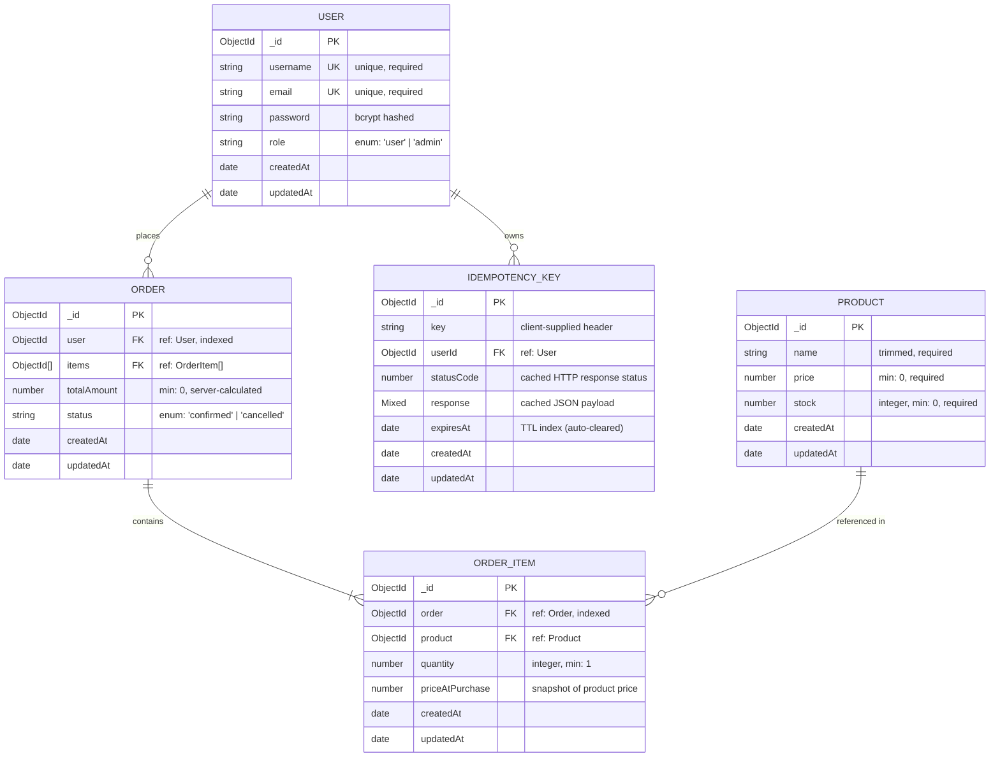

# Database Schema Documentation

This document outlines the complete MongoDB database schema, entity relationships, indexes, constraints, and data integrity patterns for the **Inventory & Order Management API**.

---

## Table of Contents

- [Entity Relationship Diagram (ERD)](#entity-relationship-diagram-erd)
- [Collections & Data Models](#collections--data-models)
  - [1. Users (`users`)](#1-users-users)
  - [2. Products (`products`)](#2-products-products)
  - [3. Orders (`orders`)](#3-orders-orders)
  - [4. OrderItems (`orderitems`)](#4-orderitems-orderitems)
  - [5. IdempotencyKeys (`idempotencykeys`)](#5-idempotencykeys-idempotencykeys)
- [Key Architectural Design Decisions](#key-architectural-design-decisions)
  - [Price Snapshotting (Historical Integrity)](#1-price-snapshotting-historical-integrity)
  - [Idempotency Key Deduplication & TTL Cleanup](#2-idempotency-key-deduplication--ttl-cleanup)
  - [IDOR Prevention & Indexing](#3-idor-prevention--indexing)
  - [Atomic Stock Decrement & Concurrency](#4-atomic-stock-decrement--concurrency)
  - [Pre-Allocated ObjectIds in ACID Transactions](#5-pre-allocated-objectids-in-acid-transactions)

---

## Entity Relationship Diagram (ERD)



---

## Collections & Data Models

### 1. Users (`users`)

Stores user credentials and authorization roles.

#### Schema Definition
| Field | Type | Required | Constraints / Validation | Description |
|---|---|---|---|---|
| `_id` | `ObjectId` | Auto | Primary Key | Unique document identifier |
| `username` | `String` | Yes | `unique: true`, trimmed | Unique username for identification |
| `email` | `String` | Yes | `unique: true`, trimmed | Unique email address for login |
| `password` | `String` | Yes | Min length 6 | Hashed with `bcrypt` (cost: 10) |
| `role` | `String` | Yes | `enum: ["user", "admin"]`, default: `"user"` | Authorization role for RBAC checks |
| `createdAt` | `Date` | Auto | Mongoose timestamps | Creation timestamp |
| `updatedAt` | `Date` | Auto | Mongoose timestamps | Last update timestamp |

#### Indexes
- `{ username: 1 }` (Unique): Prevents duplicate usernames.
- `{ email: 1 }` (Unique): Prevents multiple accounts under the same email.

#### Model Hooks & Methods
- **`pre("save")` Hook:** Automatically generates salt and hashes the `password` field using `bcrypt.hash(..., 10)` whenever the password is newly set or modified.
- **`isPasswordCorrect(candidatePassword)` Method:** Compares a plaintext password against the stored bcrypt hash using `bcrypt.compare()`.

#### Example Document
```json
{
  "_id": "651f84b6f12a392b45d2e101",
  "username": "alexdoe",
  "email": "alex@example.com",
  "password": "$2b$10$wKqK0Z...hashedPasswordString...",
  "role": "user",
  "createdAt": "2026-10-07T10:00:00.000Z",
  "updatedAt": "2026-10-07T10:00:00.000Z"
}
```

---

### 2. Products (`products`)

Represents catalog items, current prices, and live inventory count.

#### Schema Definition
| Field | Type | Required | Constraints / Validation | Description |
|---|---|---|---|---|
| `_id` | `ObjectId` | Auto | Primary Key | Unique product identifier |
| `name` | `String` | Yes | `trim: true` | Display name of the product |
| `price` | `Number` | Yes | `min: 0` | Current unit price in currency units |
| `stock` | `Number` | Yes | `min: 0`, integer validator | Current available inventory count |
| `createdAt` | `Date` | Auto | Mongoose timestamps | Product creation timestamp |
| `updatedAt` | `Date` | Auto | Mongoose timestamps | Product modification timestamp |

#### Validation Rules
- **Stock validation:** Custom Mongoose validator `Number.isInteger` ensures fractional stock cannot be introduced.

#### Example Document
```json
{
  "_id": "651f84b6f12a392b45d2e102",
  "name": "Mechanical Keyboard",
  "price": 89.99,
  "stock": 25,
  "createdAt": "2026-10-07T10:05:00.000Z",
  "updatedAt": "2026-10-07T10:05:00.000Z"
}
```

---

### 3. Orders (`orders`)

Represents a finalized customer order, server-verified financial total, and status.

#### Schema Definition
| Field | Type | Required | Constraints / Validation | Description |
|---|---|---|---|---|
| `_id` | `ObjectId` | Auto | Primary Key | Order identifier (pre-allocated before item insert) |
| `user` | `ObjectId` | Yes | `ref: "User"`, `index: true` | Foreign key to the purchasing customer |
| `items` | `[ObjectId]` | Yes | `ref: "OrderItem"` | Array of references to individual line items |
| `totalAmount` | `Number` | Yes | `min: 0` | Server-calculated total (`Σ quantity × databasePrice`) |
| `status` | `String` | Yes | `enum: ["confirmed", "cancelled"]`, default: `"confirmed"` | Lifecycle state of the order |
| `createdAt` | `Date` | Auto | Mongoose timestamps | Order placement timestamp |
| `updatedAt` | `Date` | Auto | Mongoose timestamps | Order update timestamp |

#### Indexes
- `{ user: 1 }`: Optimized for fetching orders by user (`GET /orders`).
- Compound Query Optimization: Supports IDOR-proof single order retrieval `{ _id: orderId, user: userId }`.

#### Example Document
```json
{
  "_id": "651f84b6f12a392b45d2e103",
  "user": "651f84b6f12a392b45d2e101",
  "items": [
    "651f84b6f12a392b45d2e104"
  ],
  "totalAmount": 179.98,
  "status": "confirmed",
  "createdAt": "2026-10-07T10:15:00.000Z",
  "updatedAt": "2026-10-07T10:15:00.000Z"
}
```

---

### 4. OrderItems (`orderitems`)

Represents individual line items belonging to an order, preserving an immutable price snapshot at the moment of sale.

#### Schema Definition
| Field | Type | Required | Constraints / Validation | Description |
|---|---|---|---|---|
| `_id` | `ObjectId` | Auto | Primary Key | Unique line item identifier |
| `order` | `ObjectId` | Yes | `ref: "Order"`, `index: true` | Parent order reference |
| `product` | `ObjectId` | Yes | `ref: "Product"` | Product reference |
| `quantity` | `Number` | Yes | `min: 1`, `Number.isInteger` | Purchased quantity |
| `priceAtPurchase` | `Number` | Yes | `min: 0` | Snapshot of `Product.price` at the instant of order creation |
| `createdAt` | `Date` | Auto | Mongoose timestamps | Line item creation timestamp |
| `updatedAt` | `Date` | Auto | Mongoose timestamps | Line item update timestamp |

#### Indexes
- `{ order: 1 }`: Fast retrieval of all line items for a given order during population.

#### Example Document
```json
{
  "_id": "651f84b6f12a392b45d2e104",
  "order": "651f84b6f12a392b45d2e103",
  "product": "651f84b6f12a392b45d2e102",
  "quantity": 2,
  "priceAtPurchase": 89.99,
  "createdAt": "2026-10-07T10:15:00.000Z",
  "updatedAt": "2026-10-07T10:15:00.000Z"
}
```

---

### 5. IdempotencyKeys (`idempotencykeys`)

Guarantees at-most-once order execution by recording idempotency keys, their owners, and the resulting response.

#### Schema Definition
| Field | Type | Required | Constraints / Validation | Description |
|---|---|---|---|---|
| `_id` | `ObjectId` | Auto | Primary Key | Identifier |
| `key` | `String` | Yes | Max 128 characters | Idempotency key from the client header |
| `userId` | `ObjectId` | Yes | `ref: "User"` | User scope (prevents cross-user collisions) |
| `statusCode` | `Number` | Yes | HTTP status (e.g., `201`) | Cached status code to replay |
| `response` | `Mixed` | Yes | Arbitrary JSON payload | Complete cached response body to replay |
| `expiresAt` | `Date` | Yes | TTL Target | Expiration timestamp (24 hours from creation) |
| `createdAt` | `Date` | Auto | Mongoose timestamps | Key registration timestamp |
| `updatedAt` | `Date` | Auto | Mongoose timestamps | Key update timestamp |

#### Indexes
1. **Compound Unique Index:**
   ```javascript
   idempotencyKeySchema.index({ key: 1, userId: 1 }, { unique: true });
   ```
   - **Purpose:** Enforces that the same key string used by different users is treated independently, while preventing duplicate entries for the same user. Acts as the database-level lock during concurrent requests.
2. **TTL Index (Automatic Expiration):**
   ```javascript
   idempotencyKeySchema.index({ expiresAt: 1 }, { expireAfterSeconds: 0 });
   ```
   - **Purpose:** MongoDB background thread automatically purges documents once `expiresAt` is reached. Zero manual cleanup or cron jobs required.

#### Example Document
```json
{
  "_id": "651f84b6f12a392b45d2e105",
  "key": "d4e286ec-38e9-4e08-8f52-85a21e4a3b71",
  "userId": "651f84b6f12a392b45d2e101",
  "statusCode": 201,
  "response": {
    "success": true,
    "statusCode": 201,
    "message": "Order placed successfully",
    "data": {
      "orderId": "651f84b6f12a392b45d2e103",
      "status": "confirmed",
      "totalAmount": 179.98
    }
  },
  "expiresAt": "2026-10-08T10:15:00.000Z",
  "createdAt": "2026-10-07T10:15:00.000Z",
  "updatedAt": "2026-10-07T10:15:00.000Z"
}
```

---

## Key Architectural Design Decisions

### 1. Price Snapshotting (Historical Integrity)
A common relational & document database anti-pattern is referencing only `product._id` and looking up current price when rendering invoices or calculating customer order history. If an administrator later raises the product price from \$89.99 to \$120.00, dynamic lookups would retroactively alter the customer's historical order total.

**Implementation:**
`OrderItem` explicitly persists `priceAtPurchase: Number`. The order's financial ledger remains immutable for accounting and audits regardless of future catalog changes.

### 2. Idempotency Key Deduplication & TTL Cleanup
- **Scope by User:** Idempotency keys are compound-indexed `{ key: 1, userId: 1 }`. If User A and User B coincidentally generate the same UUID or simple string like `order-1`, they do not conflict.
- **Race Condition Handling:** If two simultaneous requests with the same key pass the initial read check, the database's unique constraint triggers error code `11000` on the loser's transaction. The code catches `11000` and replays the winner's cached response, ensuring exactly-once processing without error leakage.
- **TTL Index:** Setting `{ expireAfterSeconds: 0 }` on `expiresAt` lets MongoDB natively manage memory and disk retention without external maintenance.

### 3. IDOR Prevention & Indexing
To prevent Insecure Direct Object References (IDOR), orders are never retrieved by `_id` alone. The query pattern is:
```javascript
Order.findOne({ _id: orderId, user: authenticatedUserId })
```
The `{ user: 1 }` index ensures that evaluating both conditions is an efficient index-backed scan that rejects unauthorized cross-tenant access.

### 4. Atomic Stock Decrement & Concurrency
Naive inventory reduction:
```javascript
// ❌ VULNERABLE TO RACE CONDITIONS / OVERSELLING
const product = await Product.findById(id);
if (product.stock >= quantity) {
  product.stock -= quantity;
  await product.save();
}
```
**Atomic Implementation:**
```javascript
// ✅ ATOMIC & ISOLATED
const updated = await Product.findOneAndUpdate(
  { _id: productId, stock: { $gte: quantity } },
  { $inc: { stock: -quantity } },
  { new: true, session }
);
```
MongoDB's single-document atomic update lock guarantees that two concurrent requests for the final available unit cannot both satisfy `{ stock: { $gte: quantity } }`. One succeeds and the other fails safely (`409 Conflict`).

### 5. Pre-Allocated ObjectIds in ACID Transactions
In MongoDB:
- `Order` references an array of `OrderItem` IDs (`items: [ObjectId]`).
- `OrderItem` references its parent `Order` (`order: ObjectId`).

To break the cyclic dependency without making multiple update roundtrips inside the transaction, the backend pre-generates the parent ID:
```javascript
const orderId = new mongoose.Types.ObjectId();

// 1. Insert items with pre-allocated orderId
const items = await OrderItem.insertMany(
  lineItems.map(item => ({ ...item, order: orderId })),
  { session }
);

// 2. Insert order with known orderId and item IDs
const [order] = await Order.create(
  [{ _id: orderId, user: userId, items: items.map(i => i._id), totalAmount }],
  { session }
);
```
Both collections are inserted atomically in their final, fully referenced state.

